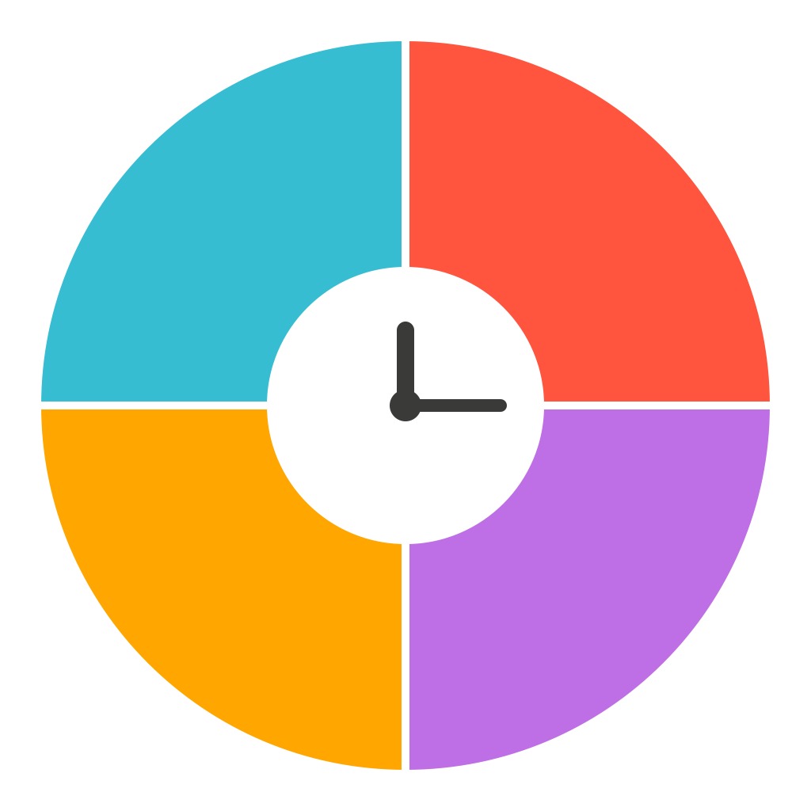
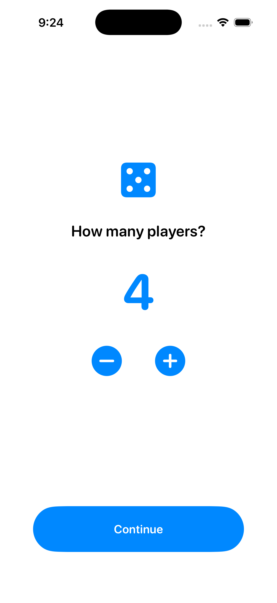
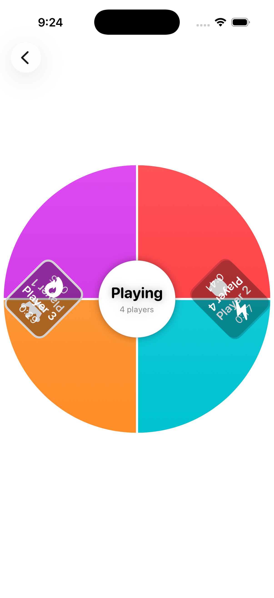
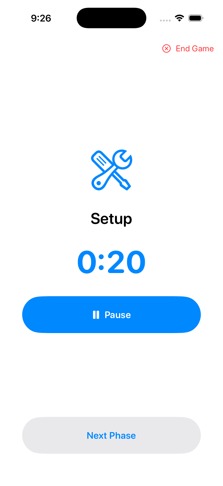
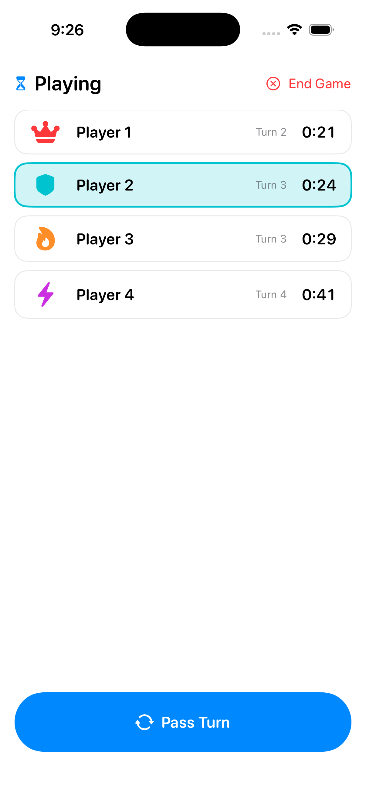
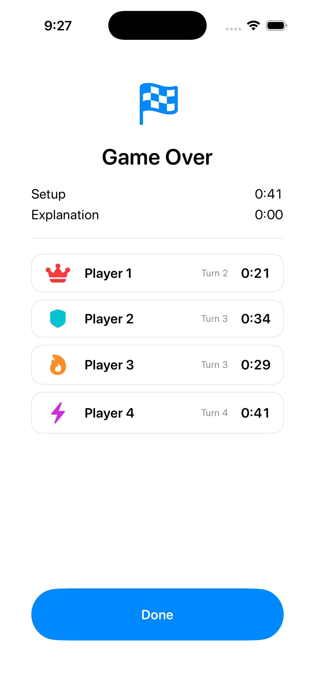

# Board Game Timer



A native SwiftUI iOS app for timing tabletop board games with up to 8 players. Set the
phone flat in the middle of the table and every player gets their own wedge of a
full-screen radial "pie" layout — name, icon, and running time rotated so it reads
upright from that player's own seat, lazy-Susan style.

Built as a beginner-friendly, milestone-by-milestone project — see [PLAN.md](PLAN.md)
for the full data model, view-model design, angle/rotation math, and build order.

<br clear="left">

## Features (in progress)

- 1–8 player setup with a simple stepper
- Signature full-screen radial pie layout, one wedge per player, content rotated
  per-seat so it's readable from anywhere around the table
- Setup / Explanation / Playing / Cleanup / Summary phase flow, each with its own timer
- Drift-free timers driven by SwiftUI's `TimelineView` (no manual `Timer`/Combine code)
- Chess-clock style turn passing: tap any player directly, or use a dedicated "Pass
  Turn" button — both increment that player's turn count and hand off their clock
- "End Game Early" escape hatch, available from any phase
- SwiftData persistence and a Past Games history (planned — Milestone 5)

## Screenshots

| Player count | Radial pie layout (Milestone 1) |
|---|---|
|  |  |

| Setup timer | Playing (chess clock) | Summary |
|---|---|---|
|  |  |  |

The radial pie layout is currently a standalone proof-of-concept with sample data
(Milestone 1); the real Setup/Explanation/Playing/Cleanup/Summary flow shown in the
other screenshots (Milestone 2) still uses a plain list for the Playing phase — the two
get reconnected in Milestone 3.

## Tech stack

- Swift & SwiftUI only (no UIKit, no third-party dependencies)
- iOS 17.0 minimum deployment target
- `@Observable` view models (not `ObservableObject`/`@Published`)
- `TimelineView` for all timer displays
- SwiftData for persistence (Milestone 5)
- Apple Human Interface Guidelines: system fonts with Dynamic Type, SF Symbols,
  semantic system colors + a custom accent color

## Project structure

```
BoardGameTimer/
  BoardGameTimerApp.swift
  Models/            GamePhase, PlayerRuntimeState
  ViewModels/        GameSessionViewModel
  Utilities/         TimeFormatting
  Views/
    PlayerCount/     Player-count picker (entry screen)
    LiveGame/        Phase banner, playing-phase list, radial pie layout, summary
```

## Build order

The project is being built in six milestones, each independently runnable in Xcode
before moving to the next:

1. **Static skeleton** — player count screen + hardcoded radial pie with fake data ✅
2. **Real timers & turn logic** — `GameSessionViewModel`, phase timers, chess-clock
   turn passing, plain list layout ✅
3. Reconnect the radial pie visual to real game data
4. Full tap-to-pass interaction layered onto the pie, with highlighting & haptics
5. SwiftData persistence + Past Games history
6. Visual/color/accessibility polish pass

See [PLAN.md](PLAN.md) for full details on each milestone.
