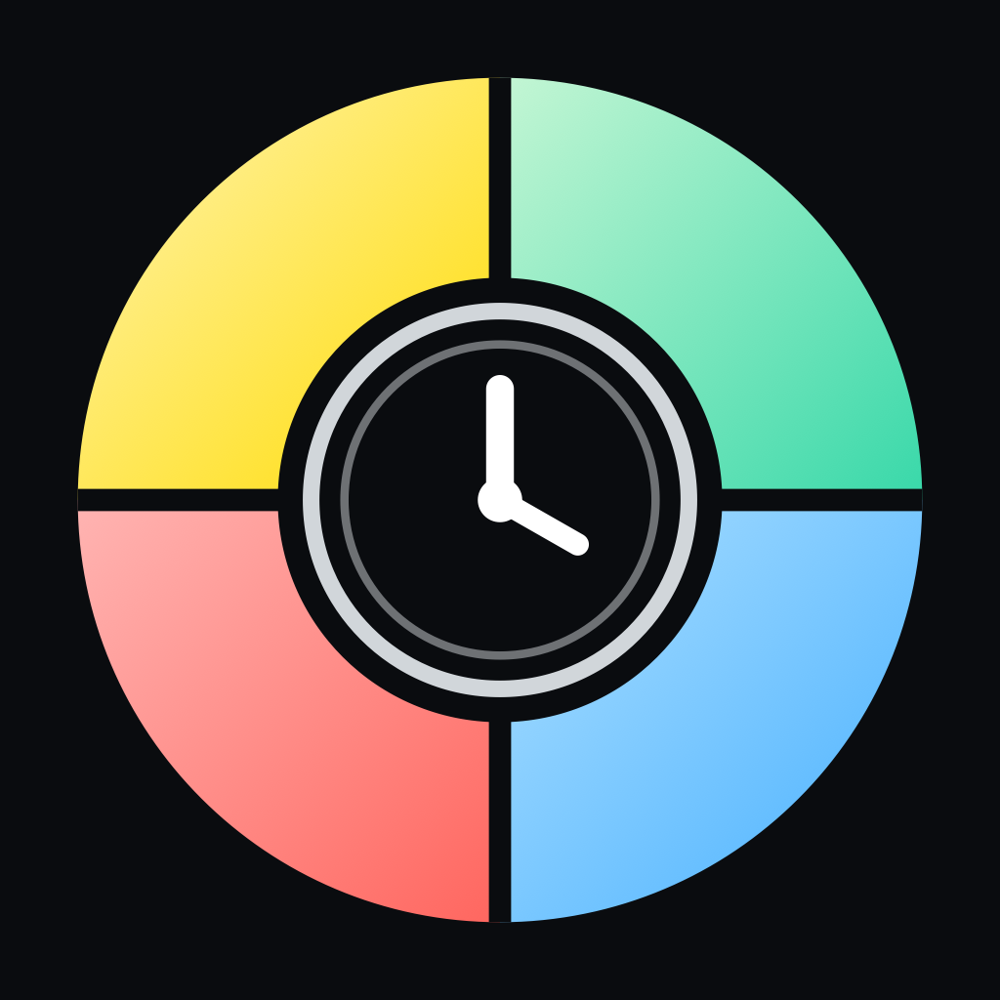
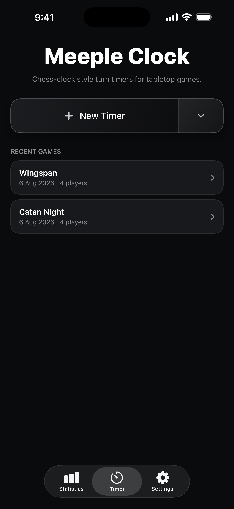
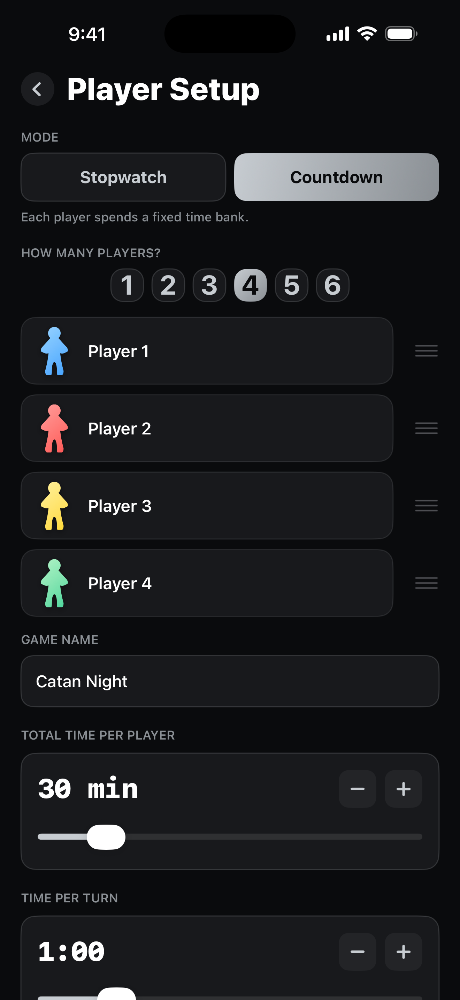
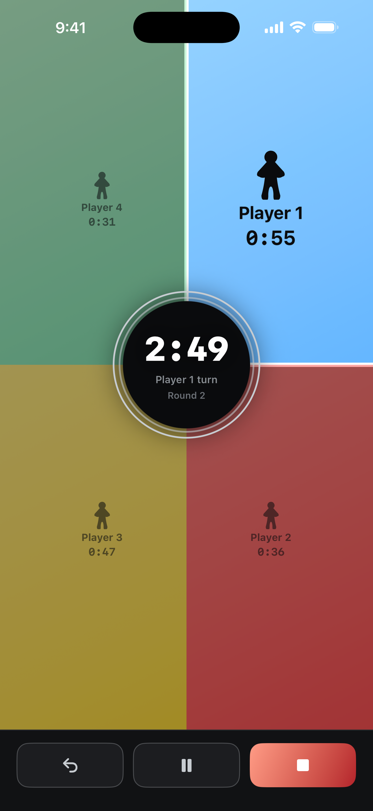
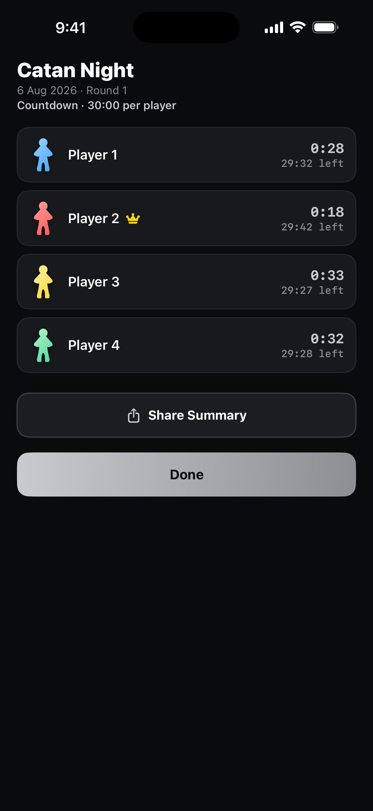
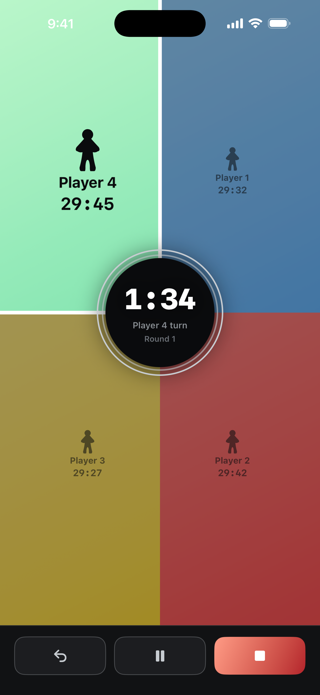

# Meeple Clock



**Meeple Clock: Board Game Timer** — a native SwiftUI iOS app for timing tabletop board
games with up to 6 players, chess-clock style. Set the phone flat in the middle of the
table: every player gets their own gradient wedge of a full-screen radial layout, tapping
your own wedge passes the turn clockwise, and a per-turn time limit calls out slowpokes
with a red overtime warning. Clocks can count up (Stopwatch) or down from a per-player time
bank (Countdown).

<br clear="left">

Built with a dark, silver-accented design language imported from an approved
[Claude Design](https://claude.ai/design) prototype. See [PLAN.md](PLAN.md) for the full
design history.

## Features

- Two modes: **Stopwatch** (clocks count up, no limit) or **Countdown** (each player spends a
  fixed time bank, 30 min by default, range 5–180 min)
- 1–6 players, each with an editable name and one of ten gradient meeple colors
- Drag-to-reorder seats, first-player picker (or random), optional game name
- Full-screen radial timer: active wedge glows and pulses, only it is tappable, and
  tapping passes the turn clockwise; 2-player games split the screen into facing halves
- Per-turn time limit (10s–5min) with red overtime warning, double-beep, and haptics —
  applies in both modes
- Running out of a countdown bank is soft: the clock goes negative in red and alarms once,
  but nobody is eliminated and no turn is auto-passed
- Whole-game clock, round counter, one-level undo, pause/resume
- Results with a crown for the fastest player and a shareable plain-text summary; countdown
  games also show how much time each player had left
- Game history saved with SwiftData — browse past games in the Statistics tab
- Quick Timer: launch a 1–6 player game with saved defaults in two taps
- Settings: default turn time, default meeple colors, sound & haptics, keep-screen-awake

## Screenshots

| Home | Player setup | Live game | Results | Countdown |
|---|---|---|---|---|
|  |  |  |  |  |

App Store-ready marketing assets (6.9" screenshots at 1320x2868, app icon exports, and the
submission checklist) live in [Marketing/](Marketing).

## Tech stack

- Swift & SwiftUI only (no UIKit view controllers)
- Firebase Analytics is the sole third-party dependency, added via Swift Package Manager
- iOS 17.0 minimum deployment target
- `@Observable` view models, `TimelineView`-driven drift-free timers (date math, never
  accumulated ticks). Countdown reuses the same upward-banking engine and simply displays
  `bank - used`, so both modes share one clock implementation
- SwiftData for persisted game history
- Fixed dark theme with a shared palette (`MeeplePalette`) and a hand-built meeple `Shape`

## Project structure

```
MeepleClock/
  MeepleClockApp.swift    App entry: splash -> tab bar, SwiftData container
  Models/                    MeeplePalette, MeepleShape, GameMode, GameRecord, GameSetupDraft
  ViewModels/                TimerGameViewModel (chess-clock engine, both modes)
  Utilities/                 TimeFormatting, AnalyticsService
  Views/
    Home/                    Timer tab landing (split New Timer button, recents)
    Setup/                   Player setup + color picker sheet
    ActiveGame/              The radial live-game screen
    Results/                 Post-game summary
    Stats/                   History tab
    Settings/                Settings tab
    About/                   About screen (developer, links, rating)
    Splash/                  Animated launch splash
```
